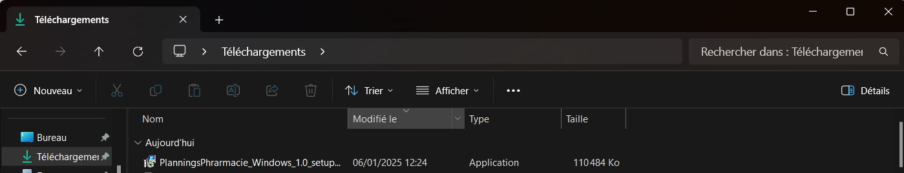
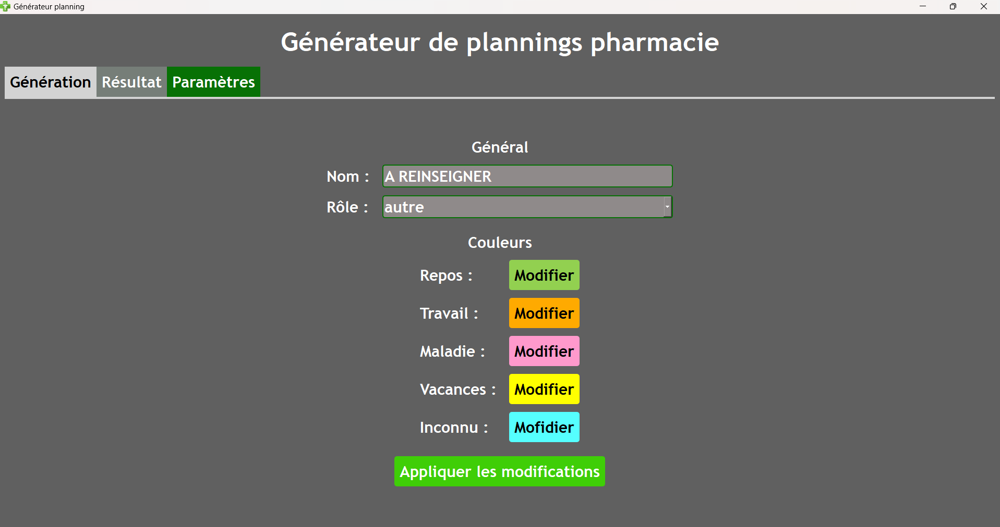

Installer le logiciel
========================

Aide pour l'installation du logiciel

Téléchargement
--------------

1. Télécharger le fichier "setup" `ICI <https://drive.google.com/uc?export=download&id=199-Bg0ES521WTa-zmf7X0REXwPr6ylhT>`_

2. Le lien ouvre un téléchargement google drive, cliquer sur "Télécharger quand même"

Execution du setup
------------------

1. Executer le fichier setup nommé "PlanningsPhrarmacie_Windows_1.0_setup" alors téléchargé, qui se trouve dans "Téléchargements"

2. Windows alerte l'utilisateur que l'éditeur du programme est inconnu, cliquez sur "informations complémentaires", puis "Executer"

3. Accepter l'alerte windows à propos de l'execution du programme

4. La fenêtre suivante apparait :

- Si vous souhaitez modifier l'emplacement du programme, cliquez sur "", sinon cliquez sur "suivant"

.. image:: _static/shortcut.png
   :alt: Example Image
   :width: 400px

- vous pouvez créer un raccourci du programme sur le bureau (recommandé) en cochant la case, puis cliquez sur "suivant"

- le récapitulatif de l'installation apparait, cliquez sur "installer"

Première utilisation
--------------------

1. Une fois le programme installé, ouvrir le programme, aller dans "Paramètres" et entrer votre nom (le même que sur les plannings) et votre rôle avant de générer !

