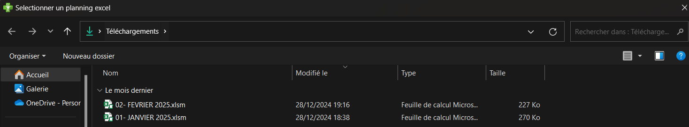

Manuel d'utilisation
=====================

Génération
----------

La page génération permet de charger un planning Excel et de générer un planning personnalisé.

1. Selection du fichier

En cliquant sur "Parcourir", un explorateur de fichier s'ouvre dans "Téléchargements", vous pouvez naviguer et selectionner le fichier Excel (.xls, .xlsm, .xlsx) souhaité.

2. Génération

En cliquant sur "génération", le planning personnalisé va se créer à partir du fichier selectionné précédemment. La génération peut prendre quelques secondes. L'onglet "Résultat" s'ouvre automatiquement aprés une génération

Résultats
---------

La page résultats permet de visualiser et enregistrer le planning personnalisé (par semaine).

1. Navigation

Les boutons "Précédent" et "Suivant" permettent la navigation à travers les différentes semaines du planning personnalisé

2. Engregistrement

Le bouton "Enregistrer" permet de conserver le planning de la semaine selectionnée sous format png (image). L'enregistrement se trouvera dans "Téléchargements" (Explorateur de fichiers).
